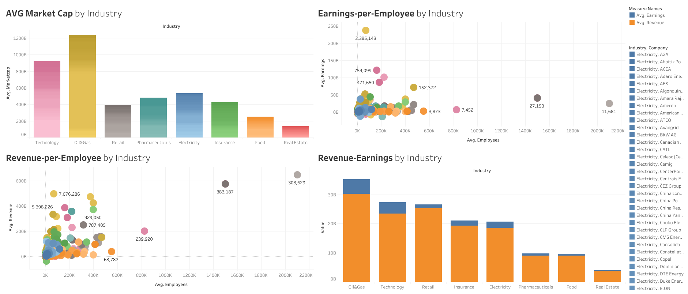
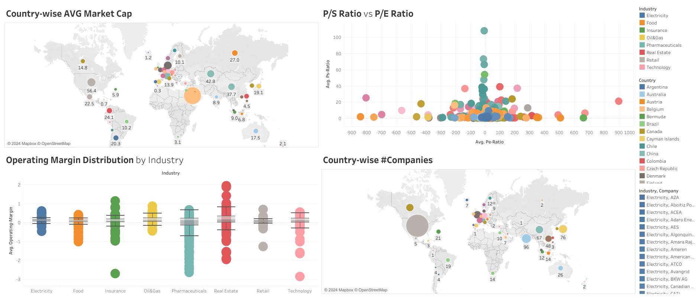

# Tableau Industry Insights Dashboard

## Problem Statement
Comprehensive financial analysis dashboards comparing the financial performance and key metrics of **1500** companies across **8** different industries. Utilizing the financial information from [companiesmarketcap.com](https://companiesmarketcap.com/) the dashboard offers a wide range of visualizations and metrics, including:

1. Bar charts comparing the average market cap, revenue, and earnings of companies in each industry.
2. Employee productivity scatter plots presenting Revenue-per-Employee and Earnings-per-Employee color coded by industry.
3. Geographic distribution of market capital and companies.
4. Comparative Price-to-Sales and Price-to-Earning Ratio identifying growth-oriented industries.
5. Box plots revealing the typical range and variability of operating margins of companies in each industry.
6. Debt-to-Equity and Current Ratio heatmaps showing financial health of companies.

Here are the links to Tableau public dashboards:
- [Industry Comparison Dashboard](https://public.tableau.com/app/profile/zibran.zarif/viz/IndustryInsightsDashboard/INDUSTRYCOMPARISON)
- [Geographical Distribution and Operating Margin Dashboard](https://public.tableau.com/app/profile/zibran.zarif/viz/IndustryInsightsDashboard/GEOGRAPHICALDIST_ANDOPERATINGMARGIN)
- [Financial Health Heatmaps Dashboard](https://public.tableau.com/app/profile/zibran.zarif/viz/IndustryInsightsDashboard/FinancialHealthDashboard)

## Findings and Observations from the Dashboards

### [Dashboard 1:](https://public.tableau.com/app/profile/zibran.zarif/viz/IndustryInsightsDashboard/INDUSTRYCOMPARISON) Industry Comparison

1. **Tehnology** has the highest average market value in general and **Real Estate** is the lowest. However, **Oil & Gas** is the leading industry in terms of total country-wise average market cap. **Saudi Arabia** is the largest contributor.
2. **Oil & Gas** industry dominates the market in terms of Average Revenue and Earnings. **Real Estate** is the lowest.
3. In terms of Revenue per employee, **Saudi Aramco** (Oil & Gas) is the highest whereas **Phoenix Group** (Insurance) is the lowest. 
4. In terms of Earnings per employee, again **Saudi Aramco** (Oil & Gas) is the highest whereas **Walgreens Boots Alliance** (Pharmaceuticals) is the lowest. On average, **Oil & Gas** is the most employee productive industry.

### [Dashboard 2:](https://public.tableau.com/app/profile/zibran.zarif/viz/IndustryInsightsDashboard/GEOGRAPHICALDIST_ANDOPERATINGMARGIN) Geographical Distribution and Operating Margin

1. **Saudi Arabia** has the largest share of market capital ($248.3T), followed by **USA** ($56.4T), and **Denmark** ($51.6T)
2. From the 1500 total companies, 591 belong to **USA** alone, followed by **India** (96), **China** (67), and **Hong Kong** (48)
3. **Real Estate** has the highest median operating margin at around 15.4%, followed by **Oil & Gas** and **Pharmaceuticals** both at approximately 11.1%. This suggests these industries tend to have healthier operating profitability on average.
4. The **Pharmaceuticals** industry has the widest spread between its upper and lower whiskers, indicating it has the most variability in operating margins. Companies span a wide range from highly profitable to unprofitable.
5. Insurance, Oil & Gas, and Real Estate have their entire boxes above the zero line, meaning **over 75%** of companies have positive margins. In contrast, **Pharmaceuticals** and **Food** have a large portion of their boxes below zero, indicating a significant number of unprofitable companies.
6. **Technology** companies tend to have both high P/S and high P/E ratios compared to other industries. It is a growth-oriented sector.
7. **Retail** and **Food** industries generally have lower P/S and P/E ratios. These are slower-growth sectors.

### [Dashboard 3:](https://public.tableau.com/app/profile/zibran.zarif/viz/IndustryInsightsDashboard/FinancialHealthDashboard) Financial Health Heatmaps Dashboard

## Build from Source
1. Clone the repo
```bash
git clone https://github.com/zzarif/Tableau-Industry-Insights-Dashboard.git
```
2. Initialize and activate virtual environment
```bash
virtualenv --no-site-packages venv
source venv/Scripts/activate
```
3. Install dependencies
```bash
pip install -r requirements.txt
```
*Note: Select virtual environment interpreter from* `Ctrl`+`Shift`+`P`
## Run the Selenium Scraper
### Traditional Approach
```bash
python companies/main.py
```
Run this command and wait for it to finish. When complete, you will get a file named [companies_data.csv](companies/companies_data.csv) (this file requires data transformation in the next step)

### Alternative Approach (Scraping Parallelly)
Using traditional approach, scraping financial data for 1500 companies one-by-one might take a significant amount of time (several hours) depending on your network bandwidth. A better and faster approach would be to split the task into multiple scraper instances that will scrape data parallely. Each scraper will be assigned to scrape financial data of the companies belonging to a particular industry.

To do this, you can simply create 8 copies of the `main.py` file (for 8 industries) and modify each `main.py` to fetch companies only for a particular industry. Now, run all the copies parallelly and merge the output CSV files.

Alternatively, you can use Python's `multiprocessing` module to spawn multiple processes to accomplish the same task.

Be sure to rename the final merged CSV file as [companies_data.csv](companies/companies_data.csv) (this file requires data transformation in the next step)

## Transform and Clean the data
```bash
python companies/transform_data.py
```
At this stage, you will get a file named [transformed_companies_data.csv](companies/transformed_companies_data.csv) (you can load this file into Tableau as Text file)